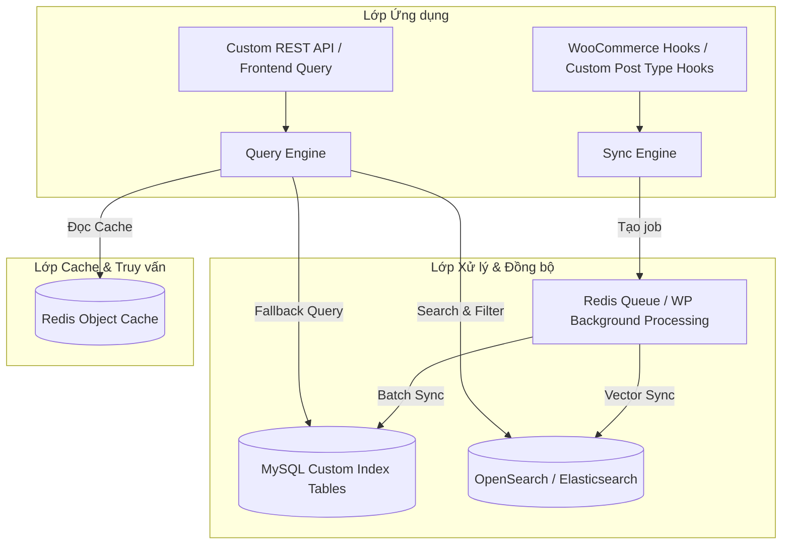

# Kế hoạch phát triển: Ultimate WooCommerce Optimize Plugin

Thiết kế và xây dựng **Ultimate WooCommerce Optimize**, một giải pháp hạ tầng chuyên sâu nhằm chuyển đổi mô hình truy vấn truyền thống của WordPress/WooCommerce (chậm chạp vì phụ thuộc vào EAV model `wp_posts` và `wp_postmeta`) sang **Kiến trúc Flat Indexing vạn năng** hiện đại, sẵn sàng cho quy mô hàng triệu bản ghi, cự ly tìm kiếm cực nhanh và hỗ trợ headless commerce cho tất cả các Custom Post Types (CPT) được bật.

---

## 🛠️ Kiến trúc Hệ thống đề xuất (Universal Flat-Indexing)

Hệ thống được thiết kế theo mô hình 4 lớp tách biệt để đảm bảo tính module hóa và khả năng mở rộng (scale ngang) cho cả Sản phẩm WooCommerce và bất kỳ Custom Post Type nào khác:



---

## 📁 Thiết kế Cấu trúc Thư mục Plugin

Chúng ta sẽ khởi tạo cấu trúc thư mục tiêu chuẩn, sạch sẽ và tuân thủ PSR-4 của WordPress:

```text
ultimate-woocommerce-optimize/
├── ultimate-woocommerce-optimize.php      # File chính bootstrap plugin
├── composer.json                          # Quản lý thư viện (Predis, OpenSearch SDK)
├── includes/
│   ├── class-uwo-activator.php            # Khởi tạo custom tables khi kích hoạt
│   ├── class-uwo-deactivator.php          # Dọn dẹp/Lưu trữ dữ liệu khi hủy kích hoạt
│   ├── class-uwo-database.php             # Quản lý schema, thao tác đọc/ghi & tự động ALTER TABLE
│   ├── class-uwo-sync-engine.php          # Lắng nghe hooks và trích xuất dữ liệu thô sang Flat
│   ├── class-uwo-redis.php                # Giao tiếp với Redis (Cache, Lock, Queue)
│   ├── class-uwo-opensearch.php           # Giao tiếp với OpenSearch / Elasticsearch
│   ├── class-uwo-query-engine.php         # Thay thế bộ query mặc định của WC & hỗ trợ Faceted Filter
│   └── class-uwo-rest-api.php             # Cung cấp các API Endpoint tối ưu siêu tốc cho Headless
├── admin/
│   ├── class-uwo-admin.php                # Đăng ký trang quản trị, menu
│   ├── css/
│   │   └── uwo-admin-premium.css          # Giao diện Premium Glassmorphism
│   └── js/
│       └── uwo-admin.js                   # Xử lý AJAX Reindex thời gian thực
└── templates/
    └── admin-dashboard.php                # Giao diện điều khiển (Index status, Redis status)
```

---

## 🚀 Cơ chế Hỗ trợ Custom Post Type Vạn Năng

> [!IMPORTANT]
> **Quyết định Kiến trúc Tối thượng (Hỗ trợ Custom Post Type):**
> Nhằm phục vụ toàn diện cho các dự án WooCommerce thực tế có hệ sinh thái CPT phức tạp (như `race_event` cho giải chạy, `brand` cho thương hiệu, `location` cho địa điểm, `hotel` cho khách sạn...), chúng tôi nâng cấp hệ thống dữ liệu:
> 1. **Chuyển đổi bảng phẳng vạn năng:** Đổi tên bảng phẳng từ `wp_uwo_products_index` thành **`wp_uwo_items_index`** và bổ sung thêm cột chỉ mục **`post_type`** để phân loại truy vấn nhanh O(1).
> 2. **Lựa chọn CPT để Index trong Settings:** Trang quản trị của plugin sẽ cung cấp một checklist cho phép Admin tùy ý tích chọn các Custom Post Type muốn đưa vào hệ thống tăng tốc (ví dụ: `product`, `race_event`, `brand`, `portfolio`).
> 3. **Lắng nghe Hook động (Dynamic Hook Listener):** 
>    - Thay vì chỉ lắng nghe sản phẩm WooCommerce, `UWO_Sync_Engine` sẽ tự động đăng ký các hooks lưu trữ động cho tất cả CPT được kích hoạt:
>      ```php
>      add_action('save_post_{$custom_post_type}', 'uwo_sync_post_to_index', 10, 3);
>      add_action('before_delete_post', 'uwo_sync_delete_post_from_index');
>      ```
>    - Quá trình phân tích dữ liệu (taxonomies, custom fields, giá cả nếu là sản phẩm) sẽ tự thích ứng theo từng loại Post Type cụ thể để map chuẩn xác nhất vào bảng `wp_uwo_items_index`.

---

## 🗄️ Cơ chế Mở rộng Schema Tự động (Dynamic Column Engine)

Để người dùng hoàn toàn rảnh tay mà vẫn giữ được tốc độ truy vấn tối đa khi cấu hình thêm các Custom Fields / ACF mới của bất kỳ Custom Post Type nào:
1. **Tự động nhận diện Custom Fields mới:** Lắng nghe các sự kiện tạo trường từ **ACF (Advanced Custom Fields)** qua hook `acf/update_field`, hoặc quét các postmeta mới phát sinh của mọi CPT được kích hoạt qua hooks `added_post_meta`/`updated_post_meta`.
2. **Tự động ALTER TABLE:** Khi phát hiện một custom field mới (ví dụ: `race_date`, `hotel_stars`) không nằm trong danh sách loại trừ (exclude list của hệ thống), Class `UWO_Database` sẽ tự động thực thi câu lệnh SQL nâng cấp bảng phẳng:
   ```sql
   ALTER TABLE `wp_uwo_items_index` 
   ADD COLUMN `cf_race_date` LONGTEXT DEFAULT NULL,
   ADD INDEX `idx_cf_race_date` (`cf_race_date`(191));
   ```
3. **Tự động đồng bộ & Cập nhật chỉ mục:** Trường dữ liệu mới sẽ ngay lập tức được điền giá trị và đánh chỉ mục cho toàn bộ các bản ghi hiện có trong các lượt đồng bộ chạy ngầm tiếp theo.

---

## 🗄️ Thiết kế Dữ liệu: Schema cho MySQL Custom Tables (Đã tối ưu cho CPT)

### Bảng chỉ mục phẳng vạn năng: `wp_uwo_items_index`

| Tên cột | Kiểu dữ liệu | Index Type | Mô tả |
| :--- | :--- | :--- | :--- |
| `id` | `BIGINT(20) UNSIGNED` | `PRIMARY KEY` | ID tự tăng của bảng index |
| `post_id` | `BIGINT(20) UNSIGNED` | `UNIQUE INDEX` | ID gốc của bài viết / sản phẩm / biến thể trong `wp_posts` |
| `parent_id` | `BIGINT(20) UNSIGNED` | `INDEX` | ID bài viết cha (đối với biến thể sản phẩm hoặc CPT phân cấp) |
| `post_type` | `VARCHAR(50)` | `INDEX` | **Cột CPT:** Lưu trữ post type gốc (ví dụ: `product`, `race_event`, `brand`) |
| `sku` | `VARCHAR(100)` | `INDEX` | Mã SKU sản phẩm (Để trống đối với các CPT không có SKU) |
| `title` | `VARCHAR(255)` | `FULLTEXT` | Tiêu đề bài viết / sản phẩm |
| `slug` | `VARCHAR(200)` | `INDEX` | Đường dẫn tĩnh |
| `price` | `DECIMAL(19,4)` | `INDEX` | Giá bán (Chỉ áp dụng với WooCommerce, để trống với CPT khác) |
| `stock_status` | `VARCHAR(20)` | `INDEX` | Trạng thái kho (Chỉ áp dụng với WooCommerce) |
| `primary_cat_id` | `BIGINT(20) UNSIGNED` | `INDEX` | Danh mục chính bài viết / sản phẩm (Lọc danh mục O(1)) |
| `attributes_filter` | `VARCHAR(500)` | `INDEX` | Chuỗi tối ưu hóa để lọc nhanh thuộc tính động |
| **`cf_[name]`** (Động) | `LONGTEXT` | `INDEX (191)` | **Cột tự động tạo thêm:** Mỗi custom field/ACF mới phát sinh của sản phẩm hay CPT sẽ tự sinh ra cột tương ứng kèm theo INDEX để lọc siêu tốc. |
| `payload_json` | `JSON` | - | Lưu trữ Payload hiển thị nhanh (Không dùng để query) |
| `search_text` | `LONGTEXT` | `FULLTEXT` | Dữ liệu gộp (Tên, SKU, Mô tả, Danh mục, Custom fields) để tìm kiếm |
| `updated_at` | `DATETIME` | `INDEX` | Thời điểm cập nhật cuối cùng |

---

## 🚀 Kế hoạch Triển khai theo từng Giai đoạn

Chúng ta sẽ tiến hành phát triển theo 4 giai đoạn chuẩn hóa:

### 🚀 Giai đoạn 1: Khởi tạo Nền tảng & Database Layer (Tuần 1)
- Thiết lập tệp chính `ultimate-woocommerce-optimize.php` và cơ chế Autoloader.
- Viết Class `UWO_Database` chịu trách nhiệm cài đặt schema bảng `wp_uwo_items_index` tự động thông qua `dbDelta`.
- Triển khai **Dynamic Column Engine** tự động phát hiện custom field mới qua hooks ACF/Postmeta để chạy `ALTER TABLE` thêm cột và Index tự động.
- Triển khai Class `UWO_Sync_Engine` để map dữ liệu thô của WooCommerce & Custom Post Types sang Flat.

### 🔄 Giai đoạn 2: Lớp Đồng bộ Thời gian thực & Xử lý nền (Tuần 2)
- Tích hợp hook đồng bộ động: Đăng ký các hook `save_post_{$cpt}` động dựa trên danh sách các Custom Post Type được Admin cấu hình kích hoạt trong dashboard.
- Triển khai cơ chế chạy ngầm (Background Worker) sử dụng **Redis Queue (nếu có Redis)** hoặc fallback về **Action Scheduler / WP Background Processing** để xử lý bất đồng bộ (async indexing) khi cập nhật số lượng lớn.
- Viết API CLI (WP-CLI) cho phép reindex toàn bộ dữ liệu nhanh chóng qua dòng lệnh.

### ⚡ Giai đoạn 3: Caching, Tìm kiếm MySQL FULLTEXT & OpenSearch Connector (Tuần 3)
- Triển khai Class `UWO_Redis` kết nối Redis Object Cache cho các truy vấn lọc danh mục, giá cả.
- Viết bộ máy truy vấn `UWO_Query_Engine` thay thế luồng truy vấn mặc định:
  - Nếu số lượng bản ghi từ **10k - 100k**: Sử dụng trực tiếp `FULLTEXT INDEX` của MySQL trên cột `search_text` kèm các cột vật lý có Index để lọc siêu tốc.
  - Nếu số lượng bản ghi từ **100k - 1M+**: Kích hoạt cầu nối OpenSearch/Elasticsearch bằng cách chuyển đổi dữ liệu phẳng MySQL thành Elasticsearch Document và truy vấn thông qua REST API.
- Tích hợp công nghệ Faceted Search (Lọc tổ hợp thuộc tính, giá, danh mục cùng lúc trong < 50ms).

### 🖥️ Giai đoạn 4: Thiết kế Giao diện Premium Dashboard & API Ready (Tuần 4)
- Xây dựng bảng điều khiển quản trị phong cách **Glassmorphism**:
  - checklist lựa chọn các Custom Post Type cần tăng tốc.
  - Biểu đồ theo dõi tiến độ index thời gian thực.
  - Nút chuyển đổi nhanh các chế độ (Chỉ MySQL + Redis / MySQL + Redis + OpenSearch).
  - Trạng thái kết nối Redis và OpenSearch trực quan.
- Đăng ký cổng API tối ưu `/wp-json/uwo/v1/` phục vụ cho Headless Commerce hoặc bộ lọc AJAX siêu mượt ngoài frontend.

---

## 🔬 Kế hoạch Kiểm thử & Xác minh (Verification Plan)

### 1. Kiểm thử hiệu năng (Benchmark Performance)
- **Chuẩn bị dữ liệu mẫu**: Sử dụng script sinh tự động 50,000 sản phẩm và 10,000 Custom Post Type `race_event` kèm theo 3 custom fields.
- **Tiêu chí đánh giá**:
  - Thời gian phản hồi bộ lọc (Faceted filter): Phải `< 50ms`.
  - Thời gian tìm kiếm từ khóa (Full-text search): Phải `< 100ms`.
  - Độ chính xác của đồng bộ realtime: Khi cập nhật một `race_event` hoặc sản phẩm mới, dữ liệu trong bảng phẳng vạn năng `wp_uwo_items_index` phải cập nhật ngay trong vòng `< 1s`.

### 2. Kiểm thử Khả năng tương thích (Compatibility Testing)
- Kiểm tra tính tương thích khi kích hoạt/hủy kích hoạt plugin (phải bảo toàn dữ liệu gốc của WooCommerce và CPTs).
- Kiểm thử cơ chế tự phục hồi (Self-healing) khi bảng index phẳng bị mất đồng bộ.
